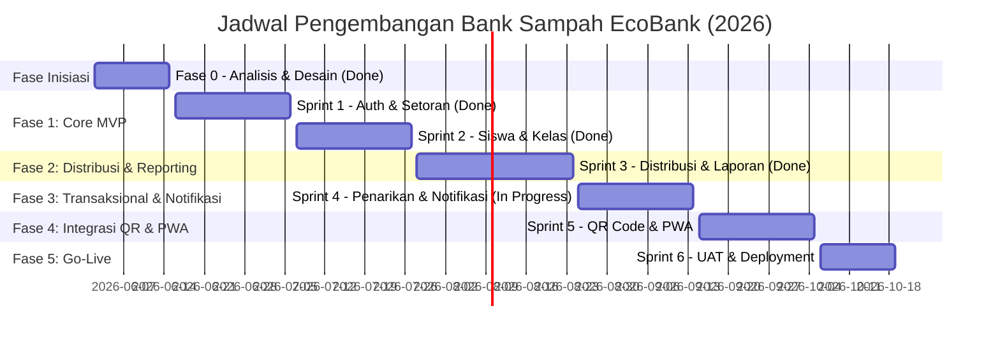

# Rencana Detail Sprint (Sprint Plan) — Aplikasi Bank Sampah EcoBank
**SMKN 2 Indramayu | Tahun Akademik 2026**

Dokumen ini menyajikan pemetaan sprint yang mendalam, mencakup status implementasi fitur terkini (Fase 0, Sprint 1, Sprint 2, Sprint 3) dan rincian teknis serta fungsional untuk sprint mendatang (Sprint 4 hingga Sprint 6) guna memandu masa pengembangan sistem aplikasi Bank Sampah EcoBank.

---

## 📋 Ringkasan Proyek & Status Terkini (Per 10 Juli 2026)

Aplikasi Bank Sampah EcoBank dikembangkan dengan pendekatan **Mobile-First Web PWA** menggunakan tech stack **Laravel (PHP) + Vite + Tailwind/Vanilla CSS** dan database relasional (SQLite untuk lokal, bermigrasi ke MySQL/PostgreSQL untuk produksi).

> [!NOTE]
> Proses pengembangan berjalan lebih cepat dari jadwal semula (ahead of schedule). Modul Distribusi Sampah & Laporan Dinamis (Sprint 3) telah selesai diimplementasikan secara penuh. Modul Transaksional & Notifikasi (Sprint 4) saat ini sedang dalam proses pengembangan (In Progress).

### 📊 Laju Pengembangan (Velocity & Progress)


---

## 🛠️ Detil Fitur Terimplementasi (Sprint 0 - Sprint 3)

Hingga saat ini, pondasi utama aplikasi beserta modul pelaporan dan distribusi telah berhasil diimplementasikan di dalam codebase. Berikut adalah pemetaan detail file yang terbuat beserta fiturnya:

### 1. Sistem Autentikasi & RBAC (Sprint 1)
*   **Fitur**: Login multi-role (Siswa, Operator, Wali Kelas, Manajer), middleware pembatasan hak akses (Guard & Middleware), dan logout aman.
*   **Komponen Teknis**:
    *   [AuthController.php](file:///a:/Project/SMKN%202%20Indramayu/Bank%20Sampah%20App/app/Http/Controllers/AuthController.php): Mengatur alur login, registrasi mandiri siswa, dan session logout.
    *   `database/migrations/2026_07_01_063958_create_permission_tables.php`: Migrasi Spatie Roles & Permissions.
    *   [web.php](file:///a:/Project/SMKN%202%20Indramayu/Bank%20Sampah%20App/routes/web.php): Proteksi route menggunakan middleware `auth` dan `role:xxx`.

### 2. Modul Setoran Sampah & Manajemen Siswa (Sprint 1 & 2)
*   **Fitur**: Pencarian cepat siswa (AJAX Live Search), input setoran sampah multi-kategori dengan kalkulasi nominal saldo/poin otomatis, konfirmasi struk digital, pendaftaran manual siswa, serta import massal siswa dari file CSV.
*   **Komponen Teknis**:
    *   [OperatorController.php](file:///a:/Project/SMKN%202%20Indramayu/Bank%20Sampah%20App/app/Http/Controllers/OperatorController.php): Mengatur logika `storeSetor()`, `searchStudents()`, `confirmSetor()`, dan `confirmBatch()` (konfirmasi setoran massal multi-kategori).
    *   `database/migrations/2026_05_25_101433_create_waste_categories_table.php`: Tabel kategori sampah (`name`, `price_per_kg`, `points_per_kg`).
    *   `database/migrations/2026_05_25_101434_create_transactions_table.php`: Tabel transaksi (`type: setor/tarik`, `weight`, `amount`, `points`, `status`).

### 3. Portal Siswa & Gamifikasi Liga Mingguan (Sprint 2)
*   **Fitur**: Dashboard ringkasan saldo, poin, dan target progres tabungan; riwayat transaksi; leaderboard peringkat siswa teraktif; pengeditan profil dengan unggah foto avatar; pengajuan penarikan dana awal; serta sistem liga mingguan (Duolingo-style) dengan banner/popup hasil reset mingguan.
*   **Komponen Teknis**:
    *   [SiswaController.php](file:///a:/Project/SMKN%202%20Indramayu/Bank%20Sampah%20App/app/Http/Controllers/SiswaController.php): Logika `dashboard()` (menampilkan status reset liga lewat flag `seen_weekly_result`), `history()`, `leaderboard()` (dengan optimasi caching query), `requestWithdraw()`, dan `updateProfile()`.
    *   [ResetWeeklyLeague.php](file:///a:/Project/SMKN%202%20Indramayu/Bank%20Sampah%20App/app/Console/Commands/ResetWeeklyLeague.php): Command `league:reset` untuk memproses naik/turun tingkat liga (Bronze, Silver, Gold, Diamond) berdasarkan kontribusi mingguan dan mereset poin mingguan.
    *   [leaderboard.blade.php](file:///a:/Project/SMKN%202%20Indramayu/Bank%20Sampah%20App/resources/views/siswa/leaderboard.blade.php): Visualisasi peringkat liga personal & global dengan caching server.

### 4. Portal Wali Kelas, Kelas, & Kelulusan (Sprint 2)
*   **Fitur**: Wali kelas memantau kontribusi sampah kelasnya, melakukan registrasi manual/bulk siswa baru via CSV, melihat detail tabungan individual (breakdown per kategori dan transaksi), dan bulk approval pendaftaran siswa. Manajer mengelola kelas, memetakan wali kelas, dan menjalankan roll-over kenaikan kelas / tahun ajaran baru.
*   **Komponen Teknis**:
    *   [WaliKelasController.php](file:///a:/Project/SMKN%202%20Indramayu/Bank%20Sampah%20App/app/Http/Controllers/WaliKelasController.php): Logika `dashboard()` kelas, `showPendaftar()`, `approveBulk()`, `rejectBulk()`, `studentDetail()` (JSON API detail tabungan siswa), `showRegisterForm()`, `registerSingleStudent()`, dan `registerBulkStudents()` (dengan normalisasi BOM dan deteksi pembatas `,`/`;` dinamis).
    *   [ManajerController.php](file:///a:/Project/SMKN%202%20Indramayu/Bank%20Sampah%20App/app/Http/Controllers/ManajerController.php): Logika `indexClassrooms()`, `storeClassroom()`, `destroyClassroom()`, `rollOverSchoolYear()` (proses naik tingkat kelas dan kelulusan massal otomatis), dan `updateSchoolYear()`.
    *   `database/migrations/2026_07_03_064336_create_classrooms_table.php`, `2026_07_03_064340_add_classroom_id_to_users_table.php`, dan `2026_07_03_064343_create_classroom_user_table.php`: Migrasi relasi kelas & wali kelas.

### 5. Modul Distribusi Sampah & Laporan Dinamis (Sprint 3)
*   **Fitur**: Pencatatan sampah keluar dari gudang melalui 2 jalur (Jual ke Agen & Unit Pengolahan Internal), manajemen harga & kategori sampah, konsol laporan dinamis sekolah & kelas dengan filter multi-parameter, serta ekspor laporan ke Excel & PDF.
*   **Komponen Teknis**:
    *   [DistributionController.php](file:///a:/Project/SMKN%202%20Indramayu/Bank%20Sampah%20App/app/Http/Controllers/DistributionController.php): Logika CRUD distribusi, penanganan stok gudang, dan `printReceipt()` (cetak nota surat jalan barang keluar).
    *   [ManajerController.php](file:///a:/Project/SMKN%202%20Indramayu/Bank%20Sampah%20App/app/Http/Controllers/ManajerController.php) & [WaliKelasController.php](file:///a:/Project/SMKN%202%20Indramayu/Bank%20Sampah%20App/app/Http/Controllers/WaliKelasController.php): Logika `reports()`, `exportExcel()`, dan `exportPdf()` dengan filter parameter.
    *   `app/Models/Distribution.php` & `app/Models/DistributionItem.php`: Struktur model pelacakan batch pengeluaran sampah.
    *   `database/migrations/2026_07_28_000000_create_distributions_table.php`: Struktur database distribusi.
    *   [DynamicTransactionsExport.php](file:///a:/Project/SMKN%202%20Indramayu/Bank%20Sampah%20App/app/Exports/DynamicTransactionsExport.php): Handler ekspor Excel menggunakan Laravel Excel.
    *   [ManajerController.php (Kategori Sampah)](file:///a:/Project/SMKN%202%20Indramayu/Bank%20Sampah%20App/app/Http/Controllers/ManajerController.php#L550-L680): Logika CRUD kategori sampah, manajemen tarif harga, dan unggah berkas ikon gambar kategori.
    *   [ManajerController.php (Gudang & Performa)](file:///a:/Project/SMKN%202%20Indramayu/Bank%20Sampah%20App/app/Http/Controllers/ManajerController.php#L694-L936): `stokDetail()`, `stokCategoryDetail()`, `performaKelasDetail()`, `logTransaksiDetail()`, dan `siswaTeraktifDetail()` untuk visualisasi dan audit.

---

## 🚀 Rencana Detail Sprint Mendatang (Sprint 4 - Sprint 6)

### 💰 Sprint 4: Penarikan Dana, Notifikasi, & Audit Trail
* **Durasi**: 25 Agustus 2026 – 14 September 2026 (3 Minggu)
* **Total Story Points**: 44 SP
* **Sprint Goal**: Meningkatkan keamanan transaksional dengan persetujuan penarikan dua langkah (2-step withdrawal validation), implementasi audit trail perubahan data sensitif, dan sistem notifikasi realtime.

#### Rincian Tugas & Implementasi Teknis:
1.  **[BS-034] Pengajuan & Verifikasi Penarikan Dana (Must Have - *Sebagian Terimplementasi*)**
    *   *Deskripsi*: Alur pengajuan dana yang diusulkan oleh siswa harus melalui verifikasi oleh Operator (penyiapan uang fisik) dan persetujuan final dari Manajer sebelum saldo benar-benar didebet.
    *   *Status Saat Ini*:
        *   `SiswaController@requestWithdraw` (Selesai): Mengajukan penarikan dana dengan status awal `Menunggu`.
        *   `OperatorController@approveTarik` & `cancelTarik` (Selesai): Menyetujui/membatalkan penarikan langsung.
        *   *Tugas Tersisa*: Modifikasi alur menjadi otorisasi dua langkah: Operator memverifikasi fisik uang (`Diverifikasi Operator`) ➔ Manajer memberikan persetujuan final (`Berhasil` & debet saldo).
2.  **[BS-035, BS-036, BS-037] Sistem Notifikasi & Event Broadcasting (Should Have - *Sebagian Terimplementasi*)**
    *   *Deskripsi*: Siswa mendapat notifikasi saat setoran berhasil atau penarikan cair. Operator/Manajer mendapat notifikasi ketika ada pengajuan penarikan dana baru.
    *   *Status Saat Ini*: Event Broadcasting `TransactionCreated` telah terimplementasi di level backend saat penarikan diajukan.
    *   *Tugas Tersisa*: Integrasi Firebase Cloud Messaging (FCM) untuk push notification ke mobile browser/aplikasi, didukung Event Laravel Broadcasting menggunakan Pusher/WebSocket di sisi frontend.
3.  **[BS-038 & BS-039] Manajemen Akun Staf Lanjutan (Must Have - *Selesai*)**
    *   *Deskripsi*: Manajer dapat membuat akun, menonaktifkan akun secara aman, dan meng-assign wali kelas ke kelas spesifik.
    *   *Status Saat Ini*: Modul pendaftaran staf (`registerStaff()`) dan pengeditan/penghapusan akun staf (`indexUsers()`, `updateUser()`, `destroyUser()`) sudah selesai terimplementasi sepenuhnya di `ManajerController`.
4.  **[BS-040] Audit Trail Lengkap (Should Have - *Belum Mulai*)**
    *   *Deskripsi*: Log aktivitas otomatis untuk setiap perubahan data sensitif (perubahan saldo, harga sampah, persetujuan penarikan).
    *   *Tugas Tersisa*: Pembuatan database migration tabel `audit_logs` dan pembuatan helper global / Eloquent Observer untuk mencatat aktivitas secara otomatis.

---

### 📱 Sprint 5: Integrasi QR Code, WhatsApp Bukti, & PWA
* **Durasi**: 15 September 2026 – 05 Oktober 2026 (3 Minggu)
* **Total Story Points**: 52 SP
* **Sprint Goal**: Meningkatkan kemudahan operasional operator melalui pemindaian QR Code, notifikasi instan WhatsApp, fitur PWA Offline Mode, dan peningkatan estetika (Tema Gelap).

#### Rincian Tugas & Implementasi Teknis:
1.  **[BS-041 & BS-042] Pembuat & Pemindai QR Code Siswa (21 SP - Could Have)**
    *   *Deskripsi*: Menghasilkan QR Code unik untuk setiap siswa saat pendaftaran. Operator dapat memindai QR Code tersebut menggunakan kamera HP untuk mengidentifikasi siswa secara instan tanpa perlu mengetik nama/NISN.
    *   *Implementasi*: Integrasi package generator QR Code (`simplesoftwareio/simple-qrcode`) pada backend dan pustaka Javascript scanner QR (`html5-qrcode`) di halaman setoran Operator.
2.  **[BS-043] Pengiriman Bukti Struk via WhatsApp (8 SP - Could Have)**
    *   *Deskripsi*: Tombol share struk langsung dari Operator ke nomor WhatsApp orang twilight siswa menggunakan WhatsApp Click-to-Chat API.
3.  **[BS-044 & BS-045] Dark Mode UI & PWA Offline Mode (13 SP - Could Have)**
    *   *Deskripsi*: Antarmuka gelap yang hemat baterai untuk perangkat mobile dan fungsionalitas read-only saat jaringan internet terputus (off-grid sekolah) menggunakan Service Worker dan IndexedDB.
4.  **[BS-046 & BS-047] Caching Performa & Hardening Keamanan (10 SP - Should Have)**
    *   *Deskripsi*: Kecepatan halaman utama < 2 detik dan pengamanan tingkat tinggi via eager loading, CSP, dan rate limiting.

---

### ✅ Sprint 6: Pengujian (UAT), Pelatihan, & Deployment Produksi
* **Durasi**: 06 Oktober 2026 – 19 Oktober 2026 (2 Minggu)
* **Total Story Points**: 27 SP
* **Sprint Goal**: Memastikan kualitas aplikasi terbebas dari bug kritis, melatih pengguna (staf & siswa), serta melakukan migrasi database dan rilis ke server produksi VPS.

#### Rincian Tugas & Implementasi Teknis:
1.  **[BS-048 & BS-049] User Acceptance Testing (UAT) & Bug Fixing (16 SP - Must Have)**
    *   *Deskripsi*: Pengujian terstruktur bersama staf administrasi sekolah, guru pembimbing, dan perwakilan siswa.
2.  **[BS-050 & BS-052] Deployment VPS & Setup Monitoring Uptime (8 SP - Must Have / Should Have)**
    *   *Deskripsi*: Migrasi database SQLite ke MySQL/PostgreSQL, setup SSL Let's Encrypt, Nginx, monitoring performa, dan backup database harian terjadwal via cron job.
3.  **[BS-051] Pelatihan Pengguna & Buku Manual (3 SP - Must Have)**
    *   *Deskripsi*: Sosialisasi cara penggunaan aplikasi kepada seluruh civitas akademika SMKN 2 Indramayu dan pembuatan User Manual PDF.

---

## 💾 Desain Skema Database Tambahan (Fase 2 & 3)

Untuk mendukung implementasi Sprint 3 dan Sprint 4, berikut rancangan tabel baru:

### 1. Tabel `distributions` (Modul Arus Keluar Sampah - Sprint 3 - *Selesai*)
```sql
CREATE TABLE distributions (
    id BIGINT UNSIGNED AUTO_INCREMENT PRIMARY KEY,
    batch_date DATE NOT NULL,
    route VARCHAR(50) NOT NULL, -- 'agent' (Jual ke Agen) atau 'unit' (Unit Internal)
    total_weight DECIMAL(8, 2) NOT NULL, -- Total berat akumulatif dalam kilogram
    total_value INT UNSIGNED DEFAULT 0, -- Kas masuk jika dijual ke agen (Rp)
    agent_name VARCHAR(150) NULL, -- Nama agen pembeli jika dijual
    notes TEXT NULL,
    created_by BIGINT UNSIGNED NOT NULL, -- ID Manajer yang mengeksekusi
    created_at TIMESTAMP DEFAULT CURRENT_TIMESTAMP,
    FOREIGN KEY (created_by) REFERENCES users(id) ON DELETE CASCADE
);
```

### 2. Tabel `audit_logs` (Modul Keamanan - Sprint 4 - *Belum Mulai*)
```sql
CREATE TABLE audit_logs (
    id BIGINT UNSIGNED AUTO_INCREMENT PRIMARY KEY,
    user_id BIGINT UNSIGNED NOT NULL, -- Pelaku aksi
    action VARCHAR(100) NOT NULL, -- 'UPDATE_PRICE', 'APPROVE_WITHDRAWAL', 'BULK_CSV_IMPORT'
    description TEXT NOT NULL, -- Detil perubahan
    ip_address VARCHAR(45) NULL,
    user_agent VARCHAR(255) NULL,
    created_at TIMESTAMP DEFAULT CURRENT_TIMESTAMP,
    FOREIGN KEY (user_id) REFERENCES users(id) ON DELETE CASCADE
);
```

---

## 🎨 Panduan Estetika Antarmuka (UI/UX Guidelines)

Aplikasi didesain khusus agar nyaman digunakan di perangkat mobile (timbangan lapangan) maupun desktop (ruang manajer). 

*   **Palet Warna Premium (Eco-Green Modern)**:
    *   *Eco Emerald (Primary)*: `#0f766e` (Teal gelap yang profesional dan segar).
    *   *Mint Spark (Success/Accent)*: `#10b981` (Hijau mint terang untuk tombol sukses).
    *   *Eco Charcoal (Dark Mode Background)*: `#111827` (Abu-abu gelap pekat yang elegan).
*   **Typography**: Font **Outfit** atau **Inter** dari Google Fonts untuk kejelasan keterbacaan angka rupiah dan timbangan.
*   **Micro-Animations & Visual Feedback**: 
    *   Efek transisi halus (0.2s) pada hover tombol.
    *   Loading state visual skeleton-loader saat mencari data siswa.
    *   Toast feedback instan di pojok atas saat setoran dikonfirmasi.
