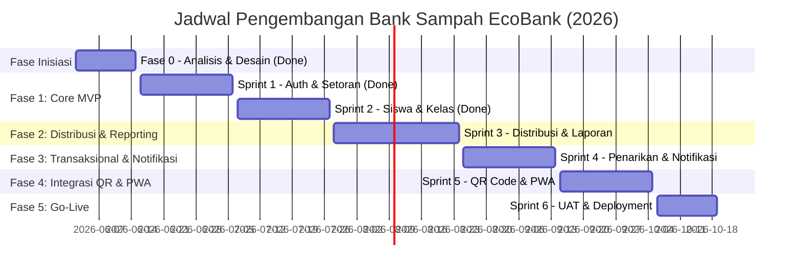
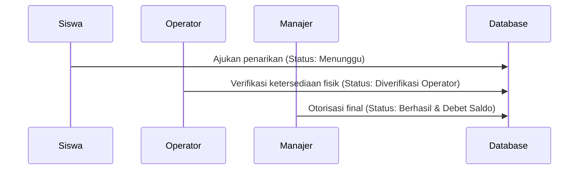

# Rencana Detail Sprint (Sprint Plan) — Aplikasi Bank Sampah EcoBank
**SMKN 2 Indramayu | Tahun Akademik 2026**

Dokumen ini menyajikan pemetaan sprint yang lebih mendalam, mencakup status implementasi fitur saat ini (Fase 0, Sprint 1, Sprint 2) dan rincian teknis serta fungsional untuk sprint mendatang (Sprint 3 hingga Sprint 6) guna memandu masa pengembangan sistem aplikasi Bank Sampah EcoBank.

---

## 📋 Ringkasan Proyek & Status Terkini (Per 3 Juli 2026)

Aplikasi Bank Sampah EcoBank dikembangkan dengan pendekatan **Mobile-First Web PWA** menggunakan tech stack **Laravel (PHP) + Vite + Tailwind/Vanilla CSS** dan database relasional (SQLite untuk lokal, bermigrasi ke MySQL/PostgreSQL untuk produksi).

### 📊 Laju Pengembangan (Velocity & Progress)


---

## 🛠️ Detil Fitur Terimplementasi (Sprint 0 - Sprint 2)

Hingga saat ini, pondasi utama aplikasi telah berhasil diimplementasikan di dalam codebase. Berikut adalah pemetaan detail file yang terbuat beserta fiturnya:

### 1. Sistem Autentikasi & RBAC (Sprint 1)
*   **Fitur**: Login multi-role (Siswa, Operator, Wali Kelas, Manajer), middleware pembatasan hak akses (Guard & Middleware), dan logout aman.
*   **Komponen Teknis**:
    *   [AuthController.php](file:///a:/Project/SMKN%202%20Indramayu/Bank%20Sampah%20App/app/Http/Controllers/AuthController.php): Mengatur alur login, registrasi mandiri siswa, dan session logout.
    *   `database/migrations/2026_07_01_063958_create_permission_tables.php`: Migrasi Spatie Roles & Permissions.
    *   [web.php](file:///a:/Project/SMKN%202%20Indramayu/Bank%20Sampah%20App/routes/web.php): Proteksi route menggunakan middleware `auth` dan `role:xxx`.

### 2. Modul Setoran Sampah & Manajemen Siswa (Sprint 1 & 2)
*   **Fitur**: Pencarian cepat siswa (AJAX Live Search), input setoran sampah dengan kalkulasi nominal saldo/poin otomatis, konfirmasi struk digital, pendaftaran manual siswa, serta import massal siswa dari file CSV.
*   **Komponen Teknis**:
    *   [OperatorController.php](file:///a:/Project/SMKN%202%20Indramayu/Bank%20Sampah%20App/app/Http/Controllers/OperatorController.php): Mengatur logika `storeSetor()`, `searchStudents()`, `confirmSetor()`, dan `registerBulkStudents()` (dengan deteksi pembatas `,` atau `;` secara dinamis).
    *   `database/migrations/2026_05_25_101433_create_waste_categories_table.php`: Tabel kategori sampah (`name`, `price_per_kg`, `points_per_kg`).
    *   `database/migrations/2026_05_25_101434_create_transactions_table.php`: Tabel transaksi (`type: setor/tarik`, `weight`, `amount`, `points`, `status`).

### 3. Portal Siswa & Gamifikasi (Sprint 2)
*   **Fitur**: Dashboard ringkasan saldo, poin, dan target progres tabungan; riwayat transaksi; leaderboard peringkat siswa teraktif; pengeditan profil dengan unggah foto avatar; serta pengajuan tarik dana awal.
*   **Komponen Teknis**:
    *   [SiswaController.php](file:///a:/Project/SMKN%202%20Indramayu/Bank%20Sampah%20App/app/Http/Controllers/SiswaController.php): Mengatur logika `dashboard()`, `history()`, `leaderboard()`, `requestWithdraw()`, dan `updateProfile()`.
    *   [leaderboard.blade.php](file:///a:/Project/SMKN%202%20Indramayu/Bank%20Sampah%20App/resources/views/siswa/leaderboard.blade.php): Menggunakan caching query untuk optimalisasi performa rendering.
    *   [profile.blade.php](file:///a:/Project/SMKN%202%20Indramayu/Bank%20Sampah%20App/resources/views/siswa/profile.blade.php): Integrasi visualisasi grafik tren tabungan siswa menggunakan Chart.js.

### 4. Portal Wali Kelas & Manajer (Sprint 2)
*   **Fitur**: Wali kelas dapat memantau kontribusi sampah kelasnya dan menyetujui pendaftaran siswa baru secara kolektif (bulk approval). Manajer dapat memantau statistik global sekolah, mengassign wali kelas, dan mengelola daftar akun staf.
*   **Komponen Teknis**:
    *   [WaliKelasController.php](file:///a:/Project/SMKN%202%20Indramayu/Bank%20Sampah%20App/app/Http/Controllers/WaliKelasController.php): Logika `dashboard()` kelas, `showPendaftar()`, `approveBulk()`, dan `rejectBulk()`.
    *   [ManajerController.php](file:///a:/Project/SMKN%202%20Indramayu/Bank%20Sampah%20App/app/Http/Controllers/ManajerController.php): Logika dashboard monitoring global, registrasi staf (`registerStaff()`), dan pengelolaan akun (`indexUsers()`, `destroyUser()`).

---

## 🚀 Rencana Detail Sprint Mendatang (Sprint 3 - Sprint 6)

### 📊 Sprint 3: Modul Distribusi Sampah & Laporan Dinamis
* **Durasi**: 28 Juli 2026 – 24 Agustus 2026 (4 Minggu)
* **Total Story Points**: 55 SP
* **Sprint Goal**: Menyelesaikan modul distribusi sampah keluar (2 jalur), manajemen harga master data sampah, dan konsol laporan dinamis (Excel/PDF) untuk Manajer & Wali Kelas.

#### Rincian Tugas & Implementasi Teknis:
1.  **[BS-026 & BS-027] Modul Distribusi Sampah Keluar (16 SP - Must Have)**
    *   *Deskripsi*: Manajer dapat mencatat sampah keluar dari gudang sekolah melalui 2 jalur:
        *   **Jalur 1 (Jual ke Agen)**: Menghasilkan kas masuk yang menambah kas operasional bank sampah sekolah.
        *   **Jalur 2 (Unit Pengolahan Internal)**: Sampah dipindahkan ke unit pupuk/kerajinan sekolah (tanpa kas masuk, hanya pengurangan stok fisik).
    *   *Implementasi*: Pembuatan database migration untuk tabel `distributions` dan `distribution_items` untuk pelacakan batch.
2.  **[BS-028 & BS-031] Konsol Filter Laporan Multi-Parameter (13 SP - Must Have)**
    *   *Deskripsi*: Filter data laporan transaksi harian berdasarkan rentang tanggal, kategori jenis sampah, kelas siswa, dan status penarikan.
    *   *Implementasi*: Penambahan query scope dinamis pada model `Transaction` dan `Distribution`. Wali kelas hanya dibatasi untuk melihat kelas asuhannya sendiri.
3.  **[BS-029 & BS-030] Ekspor Laporan ke Excel & PDF (13 SP - Should Have)**
    *   *Deskripsi*: Download laporan berkala dalam format XLSX dan PDF.
    *   *Implementasi*: Integrasi package `maatwebsite/excel` (Excel) dan `barryvdh/laravel-dompdf` (PDF) untuk mengekspor data yang terfilter.
4.  **[BS-032 & BS-033] Dashboard Arus Cashflow/Itemflow & Manajemen Rate Harga (13 SP - Should Have)**
    *   *Deskripsi*: Grafik visual arus masuk sampah (kilogram/unit) vs arus keluar sampah, serta halaman manajemen harga master data per jenis sampah.
    *   *Implementasi*:
        *   Integrasi Chart.js di dashboard Manajer untuk perbandingan visual IN/OUT.
        *   Halaman CRUD Kategori Sampah (`waste_categories`) khusus untuk Manajer dengan validasi otorisasi yang ketat.

---

### 💰 Sprint 4: Penarikan Dana Dua Langkah, Notifikasi, & Audit Trail
* **Durasi**: 25 Agustus 2026 – 14 September 2026 (3 Minggu)
* **Total Story Points**: 44 SP
* **Sprint Goal**: Meningkatkan keamanan transaksional dengan persetujuan penarikan dua langkah (2-step withdrawal validation), implementasi audit trail perubahan data sensitif, dan sistem notifikasi realtime.

#### Rincian Tugas & Implementasi Teknis:
1.  **[BS-034] Verifikasi Penarikan Dua Langkah oleh Manajer (5 SP - Must Have)**
    *   *Deskripsi*: Alur pengajuan dana yang diusulkan oleh siswa harus melalui verifikasi oleh Operator (penyiapan uang fisik) dan persetujuan final dari Manajer sebelum saldo benar-benar didebet.
    *   *Implementasi*:
        *   Modifikasi status transaksi penarikan: `Menunggu` (Operator verification) ➔ `Disetujui Manajer` (Manager approval) ➔ `Berhasil` (Selesai/Debet).

2.  **[BS-035, BS-036, BS-037] Sistem Notifikasi Realtime (18 SP - Should Have)**
    *   *Deskripsi*: Siswa mendapat notifikasi saat setoran berhasil atau penarikan cair. Operator/Manajer mendapat notifikasi ketika ada pengajuan penarikan dana baru.
    *   *Implementasi*: Integrasi Firebase Cloud Messaging (FCM) untuk push notification ke mobile browser/aplikasi, didukung Event Laravel Broadcasting menggunakan Pusher/WebSocket.
3.  **[BS-038 & BS-039] Manajemen Akun Staf Lanjutan (13 SP - Must Have)**
    *   *Deskripsi*: Manajer dapat membuat akun, menonaktifkan akun secara aman, dan meng-assign wali kelas ke kelas spesifik.
    *   *Implementasi*: Form input assign wali kelas dengan dropdown kelas dinamis dari tabel `classes`.
4.  **[BS-040] Audit Trail Lengkap (8 SP - Should Have)**
    *   *Deskripsi*: Log aktivitas otomatis untuk setiap perubahan data sensitif (perubahan saldo, harga sampah, persetujuan penarikan).
    *   *Implementasi*: Pembuatan database migration tabel `audit_logs` dan pembuatan helper global / Eloquent Observer untuk mencatat aktivitas secara otomatis.

---

### 📱 Sprint 5: Integrasi QR Code, WhatsApp Bukti, & Optimalisasi PWA
* **Durasi**: 15 September 2026 – 05 Oktober 2026 (3 Minggu)
* **Total Story Points**: 52 SP
* **Sprint Goal**: Meningkatkan kemudahan operasional operator melalui pemindaian QR Code, notifikasi instan WhatsApp, fitur PWA Offline Mode, dan peningkatan estetika (Dark Mode).

#### Rincian Tugas & Implementasi Teknis:
1.  **[BS-041 & BS-042] Pembuat & Pemindai QR Code Siswa (21 SP - Could Have)**
    *   *Deskripsi*: Menghasilkan QR Code unik untuk setiap siswa saat pendaftaran. Operator dapat memindai QR Code tersebut menggunakan kamera HP untuk mengidentifikasi siswa secara instan tanpa perlu mengetik nama/NISN.
    *   *Implementasi*:
        *   Integrasi package generator QR Code (e.g. `simplesoftwareio/simple-qrcode`) pada backend.
        *   Integrasi pustaka Javascript scanner QR (e.g. `html5-qrcode`) di halaman setoran Operator.
2.  **[BS-043] Pengiriman Bukti Struk via WhatsApp (8 SP - Could Have)**
    *   *Deskripsi*: Tombol share struk langsung dari Operator ke nomor WhatsApp orang tua siswa.
    *   *Implementasi*: Menggunakan integrasi WhatsApp Click-to-Chat API link (`https://wa.me/no_hp?text=pesan`) yang otomatis memformat rincian setoran (berat, nominal rupiah, poin).
3.  **[BS-044 & BS-045] Dark Mode UI & PWA Offline Mode (13 SP - Could Have)**
    *   *Deskripsi*: Antarmuka gelap yang hemat baterai untuk perangkat mobile dan fungsionalitas read-only saat jaringan internet terputus (off-grid sekolah).
    *   *Implementasi*:
        *   Konfigurasi tema gelap pada CSS global menggunakan class selector `.dark`.
        *   Optimasi Service Worker pada PWA untuk menyimpan cache data daftar siswa lokal secara aman di IndexedDB.
4.  **[BS-046 & BS-047] Caching Performa & Hardening Keamanan (10 SP - Should Have)**
    *   *Deskripsi*: Kecepatan halaman utama < 2 detik dan pengamanan tingkat tinggi.
    *   *Implementasi*: Optimalisasi query dengan Eager Loading (`with()`), implementasi Content Security Policy (CSP), dan proteksi rate limiting pada login.

---

### ✅ Sprint 6: Pengujian (UAT), Pelatihan, & Deployment Produksi
* **Durasi**: 06 Oktober 2026 – 19 Oktober 2026 (2 Minggu)
* **Total Story Points**: 27 SP
* **Sprint Goal**: Memastikan kualitas aplikasi terbebas dari bug kritis, melatih pengguna (staf & siswa), serta melakukan migrasi database dan rilis ke server produksi VPS.

#### Rincian Tugas & Implementasi Teknis:
1.  **[BS-048 & BS-049] User Acceptance Testing (UAT) & Bug Fixing (16 SP - Must Have)**
    *   *Deskripsi*: Pengujian terstruktur bersama staf administrasi sekolah, guru pembimbing, dan perwakilan siswa. Perbaikan bug prioritas tinggi segera setelah UAT selesai.
    *   *Implementasi*: Penyiapan form UAT skenario uji (pendaftaran ➔ setoran ➔ penarikan ➔ laporan) dan tracking bug menggunakan Git issues.
2.  **[BS-050 & BS-052] Deployment VPS & Setup Monitoring Uptime (8 SP - Must Have / Should Have)**
    *   *Deskripsi*: Migrasi database SQLite ke MySQL/PostgreSQL, setup SSL, domain, dan monitoring performa.
    *   *Implementasi*: Konfigurasi server Nginx pada VPS (Ubuntu/Hostinger), setup SSL Let's Encrypt, integrasi logging error (e.g. Sentry/Rollbar), dan backup database harian terjadwal via cron job.
3.  **[BS-051] Pelatihan Pengguna & Buku Manual (3 SP - Must Have)**
    *   *Deskripsi*: Sosialisasi cara penggunaan aplikasi kepada seluruh civitas akademika SMKN 2 Indramayu.
    *   *Implementasi*: Pembuatan dokumen panduan pengguna (User Manual PDF) dan demo singkat saat apel sekolah atau pertemuan wali kelas.

---

## 💾 Desain Skema Database Tambahan (Fase 2 & 3)

Untuk mendukung implementasi Sprint 3 dan Sprint 4, berikut rancangan tabel baru yang harus dimigrasikan:

### 1. Tabel `distributions` (Modul Arus Keluar Sampah - Sprint 3)
```sql
CREATE TABLE distributions (
    id BIGINT UNSIGNED AUTO_INCREMENT PRIMARY KEY,
    batch_date DATE NOT NULL,
    route VARCHAR(50) NOT NULL, -- 'agent' (Jual ke Agen) atau 'unit' (Unit Internal)
    total_weight DECIMAL(8, 2) NOT NULL, -- Total berat akumulatif dalam kilogram
    total_value INT UNSIGNED DEFAULT 0, -- Kas masuk jika dijual ke agen (Rp)
    agent_name VARCHAR(150) NULL, -- Nama agen pembeli jika dijual
    notes TEXT NULL,
    created_by BIGINT UNSIGNED NOT NULL, -- ID Manajer yang mengeksekusi
    created_at TIMESTAMP DEFAULT CURRENT_TIMESTAMP,
    FOREIGN KEY (created_by) REFERENCES users(id) ON DELETE CASCADE
);
```

### 2. Tabel `audit_logs` (Modul Keamanan - Sprint 4)
```sql
CREATE TABLE audit_logs (
    id BIGINT UNSIGNED AUTO_INCREMENT PRIMARY KEY,
    user_id BIGINT UNSIGNED NOT NULL, -- Pelaku aksi
    action VARCHAR(100) NOT NULL, -- 'UPDATE_PRICE', 'APPROVE_WITHDRAWAL', 'BULK_CSV_IMPORT'
    description TEXT NOT NULL, -- Detil perubahan (misal: "Mengubah harga botol PET dari 3000 ke 3500")
    ip_address VARCHAR(45) NULL,
    user_agent VARCHAR(255) NULL,
    created_at TIMESTAMP DEFAULT CURRENT_TIMESTAMP,
    FOREIGN KEY (user_id) REFERENCES users(id) ON DELETE CASCADE
);
```

---

## 🎨 Panduan Estetika Antarmuka (UI/UX Guidelines)

Aplikasi didesain khusus agar nyaman digunakan di perangkat mobile (timbangan lapangan) maupun desktop (ruang manajer). 

*   **Palet Warna Premium (Eco-Green Modern)**:
    *   *Eco Emerald (Primary)*: `#0f766e` (Teal gelap yang profesional dan segar).
    *   *Mint Spark (Success/Accent)*: `#10b981` (Hijau mint terang untuk tombol sukses).
    *   *Eco Charcoal (Dark Mode Background)*: `#111827` (Abu-abu gelap pekat yang elegan).
*   **Typography**: Font **Outfit** atau **Inter** dari Google Fonts untuk kejelasan keterbacaan angka rupiah dan timbangan.
*   **Micro-Animations & Visual Feedback**: 
    *   Efek transisi halus (0.2s) pada hover tombol.
    *   Loading state visual skeleton-loader saat mencari data siswa.
    *   Toast feedback instan di pojok atas saat setoran dikonfirmasi.
