# 📊 Diagram Use Case - EcoBank (Aplikasi Bank Sampah)
**SMKN 2 Indramayu | Tahun Akademik 2026**

Dokumen ini mendokumentasikan diagram *Use Case* untuk aplikasi Bank Sampah EcoBank. Struktur diagram telah diperbarui agar sepenuhnya sesuai dengan standar UML klasik (seperti contoh diagram ATM Anda):
*   Aktor berada di luar batas sistem (*subsystem boundary*), diposisikan di sebelah kiri dan kanan.
*   Batas sistem (*system boundary*) digambarkan menggunakan kotak persegi.
*   Kasus penggunaan (*use cases*) digambarkan menggunakan bentuk oval di dalam batas sistem.
*   Hubungan asosiasi berupa garis lurus solid tanpa mata panah (`---`).

---

## 👥 Aktor Sistem (Actors)

Aplikasi Bank Sampah EcoBank memiliki 5 aktor utama dengan batasan hak akses masing-masing:

| Aktor | Deskripsi Peran | Posisi Diagram |
| :--- | :--- | :--- |
| **Pengunjung (Guest)** | Pengguna yang belum terautentikasi (belum login). Berinteraksi dengan fungsi otentikasi dasar. | Sisi Kiri (Inisiator) |
| **Siswa (Nasabah)** | Pengguna akhir yang menabung sampah. Dapat memantau saldo/poin, mengajukan penarikan, dan melihat peringkat. | Sisi Kiri (Inisiator) |
| **Operator (Staf)** | Staf operasional bank sampah di lapangan. Bertanggung jawab atas pencatatan setoran fisik, registrasi nasabah, dan verifikasi fisik penarikan. | Sisi Kiri (Inisiator) |
| **Wali Kelas** | Guru pembimbing kelas. Memantau kontribusi sampah kelasnya dan menyetujui registrasi siswa baru dari kelasnya. | Sisi Kiri (Inisiator) |
| **Manajer (Admin)** | Kepala bank sampah sekolah. Mengelola akun staf, master data kategori sampah, distribusi eksternal, otorisasi penarikan dana final, dan melihat log audit. | Sisi Kanan (Penerima/Penyetuju) |

---

## 🌐 Batasan Sistem & Diagram UML Klasik Global

Berikut adalah visualisasi standar UML klasik untuk diagram *Use Case* EcoBank:

```mermaid
graph LR
    %% Styling & Config (UML Style)
    classDef actor fill:#ffffff,stroke:#000000,stroke-width:2px;
    classDef usecase fill:#ffffff,stroke:#000000,stroke-width:1.5px;
    classDef system fill:#ffffff,stroke:#000000,stroke-width:2px;

    %% Actors on Left
    Guest(("👤 Pengunjung"))
    Siswa(("👤 Siswa\n(Nasabah)"))
    Operator(("💼 Operator\n(Staf)"))
    WaliKelas(("👨‍🏫 Wali Kelas"))

    class Guest,Siswa,Operator,WaliKelas actor;

    %% System Boundary
    subgraph EcoBank ["«subsystem»<br/>EcoBank Web App"]
        %% Common & Auth
        UC_Login([UC-01: Login])
        UC_RegSiswa([UC-02: Registrasi Mandiri Siswa])
        UC_Forgot([UC-03: Lupa/Reset Password])
        UC_Profile([UC-04: Kelola Profil & Avatar])
        UC_Logout([UC-05: Logout])

        %% Siswa Use Cases
        UC_DashSiswa([UC-06: Lihat Dashboard Tabungan])
        UC_HistSiswa([UC-07: Lihat Riwayat Transaksi])
        UC_Leaderboard([UC-08: Lihat Leaderboard])
        UC_ReqWithdraw([UC-09: Ajukan Penarikan Dana])

        %% Operator Use Cases
        UC_SearchSiswa([UC-10: Cari Siswa Live Search])
        UC_InputSetor([UC-11: Input Setoran Sampah])
        UC_ConfirmReceipt([UC-12: Cetak Struk Digital])
        UC_WAStruk([UC-13: Kirim Struk via WhatsApp])
        UC_VerifyCash([UC-14: Verifikasi Fisik Penarikan])
        UC_RegBulk([UC-15: Registrasi Siswa Manual & CSV])

        %% Wali Kelas Use Cases
        UC_DashWK([UC-16: Lihat Dashboard Kelas])
        UC_ApproveReg([UC-17: Bulk Approval Pendaftaran])
        UC_DetailSiswa([UC-18: Lihat Rincian Tabungan Siswa])

        %% Manajer Use Cases
        UC_DashMan([UC-19: Lihat Statistik Global])
        UC_ManageStaff([UC-20: Kelola Akun Staf CRUD])
        UC_ManageClass([UC-21: Kelola Kelas & Wali Kelas])
        UC_RollOver([UC-22: Roll-Over Tahun Ajaran Baru])
        UC_ManageWaste([UC-23: Kelola Kategori Sampah & Harga])
        UC_ManageDist([UC-24: Catat Distribusi Sampah])
        UC_ApproveFinal([UC-25: Otorisasi Final Penarikan])
        UC_ExportReports([UC-26: Ekspor Laporan Excel/PDF])
        UC_ViewAudit([UC-27: Lihat Log Audit Keamanan])

        class UC_Login,UC_RegSiswa,UC_Forgot,UC_Profile,UC_Logout,UC_DashSiswa,UC_HistSiswa,UC_Leaderboard,UC_ReqWithdraw,UC_SearchSiswa,UC_InputSetor,UC_ConfirmReceipt,UC_WAStruk,UC_VerifyCash,UC_RegBulk,UC_DashWK,UC_ApproveReg,UC_DetailSiswa,UC_DashMan,UC_ManageStaff,UC_ManageClass,UC_RollOver,UC_ManageWaste,UC_ManageDist,UC_ApproveFinal,UC_ExportReports,UC_ViewAudit usecase;
    end

    %% Actor on Right
    Manajer(("👑 Manajer\n(Admin)"))
    class Manajer actor;

    %% Hubungan Aktor Kiri (Aktor --- UC)
    Guest --- UC_Login
    Guest --- UC_RegSiswa
    Guest --- UC_Forgot

    Siswa --- UC_Logout
    Siswa --- UC_Profile
    Siswa --- UC_DashSiswa
    Siswa --- UC_HistSiswa
    Siswa --- UC_Leaderboard
    Siswa --- UC_ReqWithdraw

    Operator --- UC_Logout
    Operator --- UC_Profile
    Operator --- UC_SearchSiswa
    Operator --- UC_InputSetor
    Operator --- UC_ConfirmReceipt
    Operator --- UC_WAStruk
    Operator --- UC_VerifyCash
    Operator --- UC_RegBulk

    WaliKelas --- UC_Logout
    WaliKelas --- UC_Profile
    WaliKelas --- UC_DashWK
    WaliKelas --- UC_ApproveReg
    WaliKelas --- UC_DetailSiswa

    %% Hubungan Aktor Kanan (UC --- Aktor)
    UC_Logout --- Manajer
    UC_Profile --- Manajer
    UC_DashMan --- Manajer
    UC_ManageStaff --- Manajer
    UC_ManageClass --- Manajer
    UC_RollOver --- Manajer
    UC_ManageWaste --- Manajer
    UC_ManageDist --- Manajer
    UC_ApproveFinal --- Manajer
    UC_ExportReports --- Manajer
    UC_ViewAudit --- Manajer
```

---

## 🛠️ Integrasi Draw.io ( diagrams.net ) & Kode PlantUML

Untuk mempermudah Anda dalam mengedit atau memodifikasi diagram ini secara visual (seperti berkas `ERD - Bank Sampah App.drawio` yang sudah ada di proyek Anda):

1. Buka situs [Draw.io](https://app.diagrams.net/).
2. Buat dokumen baru atau buka dokumen yang sudah ada.
3. Klik menu **Arrange** -> **Insert** -> **Advanced** -> **PlantUML**.
4. Salin dan tempel kode dari file [use_case_diagram.puml](file:///a:/Project/SMKN%202%20Indramayu/Bank%20Sampah%20App/use_case_diagram.puml).
5. Draw.io akan secara otomatis menata bentuk aktor stick-figure, oval use case, dan garis asosiasi secara rapi dan dapat diedit secara manual!

---

## 📋 Deskripsi Rincian Use Case (Specification Table)

| ID | Nama Use Case | Aktor Utama | Deskripsi Singkat |
| :--- | :--- | :--- | :--- |
| **UC-01** | Login | Guest, Siswa, Operator, Wali Kelas, Manajer | Masuk ke sistem menggunakan email dan password untuk mendapatkan hak akses sesuai role masing-masing. |
| **UC-02** | Registrasi Mandiri Siswa | Guest (Siswa) | Siswa mendaftarkan diri secara mandiri melalui halaman register dengan mengisi NISN, nama, kelas, email, telepon, dan password. |
| **UC-03** | Lupa/Reset Password | Guest, Semua Aktor | Mengajukan tautan/token reset password melalui email dan mengubah password yang lupa. |
| **UC-04** | Kelola Profil & Avatar | Siswa, Operator, Wali Kelas, Manajer | Mengubah data profil pribadi (nama, nomor telepon) dan memperbarui kata sandi, serta mengganti foto avatar profil. |
| **UC-05** | Logout | Siswa, Operator, Wali Kelas, Manajer | Mengakhiri sesi masuk secara aman dan menghapus token session. |
| **UC-06** | Lihat Dashboard Tabungan | Siswa | Memantau ringkasan total saldo uang, akumulasi poin, target tabungan, grafik tren menabung, serta peringkat personal. |
| **UC-07** | Lihat Riwayat Transaksi | Siswa | Melihat log historis setoran sampah (kategori, berat, rupiah, poin) dan pengajuan penarikan dana beserta statusnya. |
| **UC-08** | Lihat Leaderboard Siswa | Siswa | Melihat daftar peringkat 10 besar siswa teraktif secara real-time berdasarkan akumulasi poin tabungan sampah. |
| **UC-09** | Ajukan Penarikan Dana | Siswa | Mengajukan nominal penarikan dana tabungan yang diinginkan dengan limit maksimum sebesar saldo aktif saat itu. |
| **UC-10** | Cari Siswa Live Search | Operator | Mencari data siswa secara instan menggunakan pencarian dinamis (AJAX) berdasarkan NISN atau Nama Lengkap. |
| **UC-11** | Input Setoran Sampah | Operator | Menginput data penimbangan sampah masuk, memilih kategori sampah, dan memasukkan berat (kg). |
| **UC-12** | Konfirmasi Struk Digital | Operator | Memvalidasi dan menampilkan ringkasan transaksi setoran yang baru selesai diinput dalam bentuk halaman struk digital. |
| **UC-13** | Kirim Struk via WhatsApp | Operator | Mengirimkan pesan berisi format detail struk setoran langsung ke nomor WhatsApp orang tua siswa menggunakan tautan API. |
| **UC-14** | Verifikasi Fisik Penarikan | Operator | Memeriksa ketersediaan uang tunai kas operasional atas pengajuan penarikan dana siswa. |
| **UC-15** | Registrasi Siswa Manual & CSV | Operator | Mendaftarkan siswa secara manual (satu per satu) atau mengimpor data massal melalui berkas CSV. |
| **UC-16** | Lihat Dashboard Kelas Asuhan | Wali Kelas | Melihat statistik agregat, total berat daur ulang kelas, total saldo kelas, dan daftar siswa yang berada di kelas asuhannya. |
| **UC-17** | Bulk Approval Pendaftaran | Wali Kelas | Menyetujui atau menolak pendaftaran akun siswa baru di kelas asuhannya secara kolektif (multi-select checklist). |
| **UC-18** | Lihat Rincian Tabungan Siswa | Wali Kelas | Melihat profil tabungan siswa di kelasnya, detail breakdown berat sampah per kategori, serta 10 riwayat transaksi terakhir. |
| **UC-19** | Lihat Statistik Global & Cashflow| Manajer | Memantau dashboard eksekutif sekolah, visualisasi grafik masuk/keluar sampah, kas global, peringkat kelas, dan 10 transaksi terbaru. |
| **UC-20** | Kelola Akun Staf CRUD | Manajer | Membuat, melihat list, memperbarui, dan menghapus akun staf operasional (Operator) dan guru (Wali Kelas). |
| **UC-21** | Kelola Kelas & Wali Kelas | Manajer | Membuat dan menghapus daftar kelas sekolah, serta memetakan (*assign*) Wali Kelas ke kelas asuhan spesifik. |
| **UC-22** | Roll-Over Tahun Ajaran Baru | Manajer | Melakukan proses naik kelas massal untuk seluruh siswa di akhir tahun ajaran (misal: tingkat X ke XI, XI ke XII, dan XII ke status Lulus). |
| **UC-23** | Kelola Kategori Sampah & Harga | Manajer | Mengelola master data jenis sampah (Botol plastik, Kertas, Logam, dll.) beserta tarif harga beli dan poin per kilogram. |
| **UC-24** | Catat Distribusi Sampah | Manajer | Mencatat pengeluaran sampah dari gudang sekolah baik untuk dijual ke agen (menambah kas) atau dikirim ke unit pemrosesan internal. |
| **UC-25** | Otorisasi Final Penarikan | Manajer | Memberikan persetujuan akhir (*final approval*) atas transaksi penarikan dana siswa yang sudah diverifikasi fisik oleh operator. |
| **UC-26** | Ekspor Laporan Excel/PDF | Manajer, Operator | Mengunduh berkas rekapitulasi data transaksi dalam format tabel Microsoft Excel (.xlsx) atau dokumen cetak (.pdf). |
| **UC-27** | Lihat Log Audit Keamanan | Manajer | Memantau riwayat log aktivitas sensitif yang dilakukan oleh staf. |
